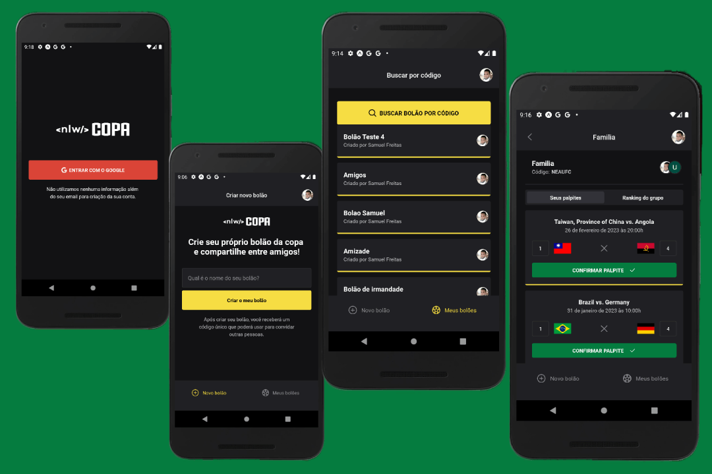

Aplicação para participar de bolões da Copa do Mundo 2022, dando palpite sobre equipes vencedoras.

 

  

## 🚀 Tecnologias

Esse projecto foi desenvolvido com as seguintes tecnologias:

- TypeScript
- React Native
- Expo

## Como executar

- Instale as dependências: `npm install`
- Criar o app no google para poder ter acesso ao OAuth (https://docs.expo.dev/guides/authentication/#google)
- Faça uma copia do arquivo `.env.example` para `.env` e preencha corretamente o `GOOGLE_CLIENT_ID` e o `API_BASE_URL` com o IP da sua máquina.
- Baixe/clone o backend/api desse projecto [Aqui](https://github.com/samuelfreitas-ao/copa-api), siga todas instruçõe lá para executar o backend.
- Execute `npm run start` para iniciar o servidor do Expo/aplicação.
